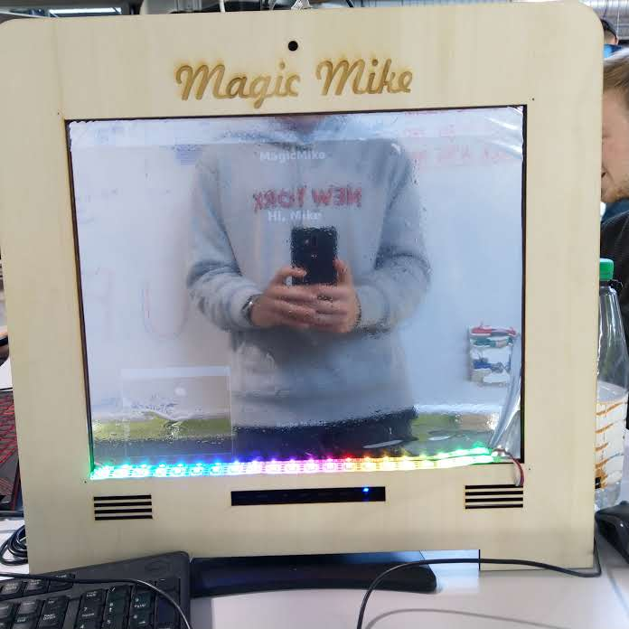

# Magic Mirror

### Description
Magic Mike is a smart mirror. It can provide all kinds of useful data at the times when you really need it.
Like just when you get out of bed and look at your sleepy face. Or when you just got home from a long day of work

### Features
- Hand gesture recognition (Swiping) to nagivate between different screen.
- Show personal traffic, weather, calendar, news, agenda information. 
- Sound plays on starting up the mirror
- LED light on screen changes

### Installation (Linux Only)
Install python 3 and the corresponding pip version, then run pip install -r requirements.txt

### Running
Use "python main.py"
For python 3 use "python3 main.py"
